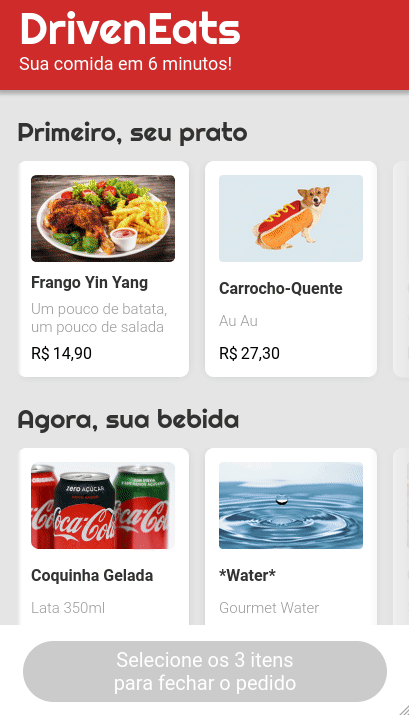

# DrivenEats

Order food online with this website!

Try it now at https://gpsign.github.io/drivenEats/

## About

This is a website with a concept to order food online. You choose the food, drink and dessert. At the end, a message will be generated with order information that will redirect the user to WhatsApp with the order ready to be sent! Below are the implemented features:

- Choose your main course, drink and dessert
- The button will be enabled after choosing one from each category
- Shows a confirm dialog with all the order information
- Automatically calculates the total price
- After clicking confirm, it generates the order and redirects the user to the WhatsApp number of the restaurant with the order ready to be sent!

## Technologies

The following tools were used in the construction of the project: 

